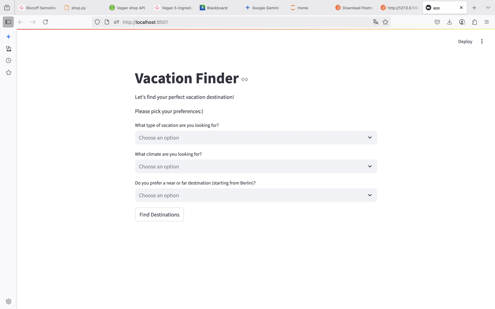
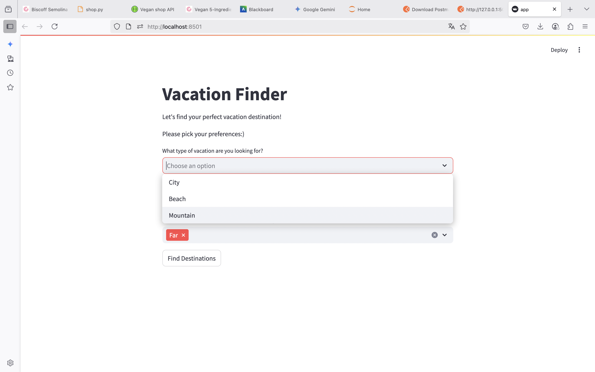
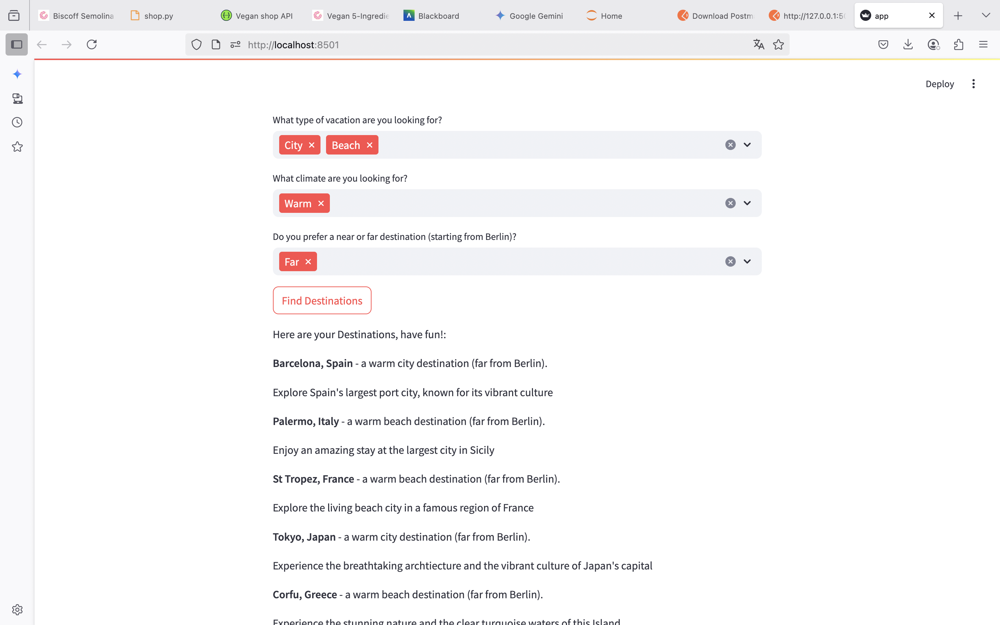
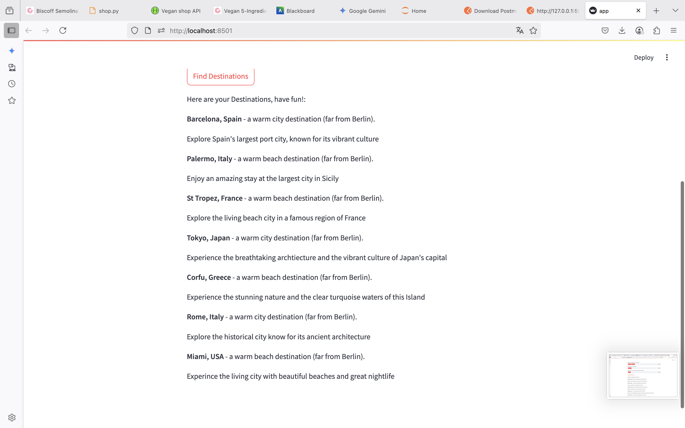

# Vacation Finder

I created this website to be very simple yet very helpful. I can never decide on where to go, so that´s why I decided on this. 
The vacation finder is great if you need a quick and simple decision for a trip, without researching first.

---

## features

These are the features my project includes:
 -3 Preferance questions (multiple choices can be done)
     -Type of location
     -Temperature
     -Distance from Berlin
 -Filters the locations based on the answers
 -Includes country names and descriptions

 ---

## How to run the app

### What´s required

-Python
-Streamlit

### Run locally

1.Clone repository/download files
2.Install dependencies
3.Run the app
4.App opens in your browser

---

## Structure

## Example

Here are some screenshots of my app!

### Landing page

### Choosing preferences

### Matching results

### Example of no results found

---

## Credits

This app was created by Giannandrea Lara Elsa for the Basics of Coding class at the Macromedia University in Berlin.

